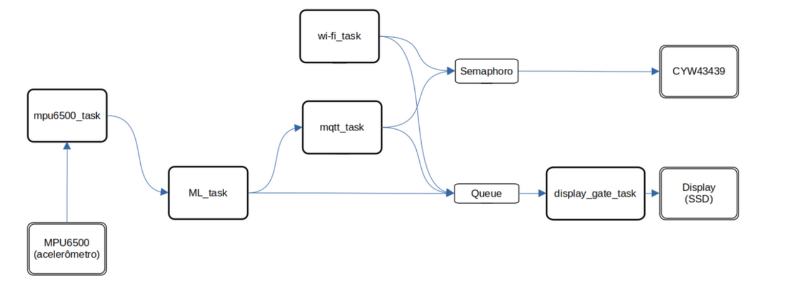

<h1 align = " center "> Classificação de Movimentos em Contêineres Marítimos com TinyML na BitDogLab </h1> 

Projeto: Embarcatech - Fase 2
----
- Adriana R. Castro de Paula    
- Elias Kento Tomiyama    
- Vagner Sanches Vasconcelos     
----

# 1. Contexto
A logística de contêineres marítimos é um componente crítico da cadeia de suprimentos global, envolvendo etapas como movimentação por empilhadeiras ou guindastes, transporte terrestre em caminhões e transporte marítimo em navios. A rastreabilidade precisa dessas etapas é essencial para otimizar rotas, reduzir custos operacionais, prevenir danos causados por vibrações excessivas e detectar anomalias em tempo real. No entanto, sistemas tradicionais baseados em GPS e registros manuais carecem de granularidade para identificar o tipo de movimento do contêiner, limitando a capacidade de resposta proativa.    
A **concepção** deste projeto é criar um sistema embarcado de baixo custo e alta autonomia, embarcado no próprio contêiner, que utilize sensores inerciais e inteligência artificial na borda (edge) para resolver esse problema. A ideia é "dar inteligência" ao contêiner, permitindo que ele "entenda" seu próprio estado de movimento e comunique essa informação em tempo real. A solução se baseia no campo emergente de Tiny Machine Learning (TinyML), que foca na implementação de modelos de aprendizado de máquina em microcontroladores com recursos limitados.    
TinyML permite a execução de modelos de aprendizado de máquina em microcontroladores com recursos limitados, como o RP2040 da plataforma BitDogLab. Este projeto propõe um sistema embarcado que utiliza o acelerômetro MPU6500, a plataforma Edge Impulse para treinamento de modelos, e o protocolo MQTT para transmissão de dados, classificando automaticamente os movimentos de contêineres em quatro classes: (i) parado (armazenado ou em espera), (ii) subindo/descendo (movimentação por empilhadeira ou guindaste), (iii) esquerda/direita (transporte terrestre), e (iv) ziguezague (transporte marítimo). O sistema opera com baixo consumo energético, exibe resultados localmente em um display SSD1306 e transmite dados via Wi-Fi, alinhando-se aos objetivos do curso Embarcatech de criar soluções embarcadas inovadoras para desafios reais.     
 
# 2. Usuários
O sistema proposto oferece utilidade direta para múltiplos atores da cadeia logística, gerando valor econômico e operacional.      
**Os usuários-alvo do sistema incluem:**    
- **Operadores logísticos:** Gerenciam cadeias de suprimentos e se beneficiam de dados em tempo real para otimizar rotas e reduzir custos (a automação do registro de etapas (ex: início do transporte terrestre) elimina a necessidade de apontamentos manuais, reduzindo erros e custos administrativos).      
- **Gestores de armazéns e portos:** Necessitam de monitoramento preciso para prevenir danos durante o manuseio e melhorar a segurança (a detecção de padrões de vibração anômalos pode indicar manuseio incorreto ou tentativa de violação, disparando alertas imediatos).
- **Desenvolvedores de sistemas embarcados:** Podem usar o projeto como base para soluções escaláveis, integrando novos sensores ou funcionalidades.    
- **Empresas de transporte marítimo:** Interessadas em rastreabilidade detalhada para detectar anomalias e melhorar a eficiência operacional.    
- **Para o Ecossistema de Cidades Inteligentes:** A coleta de dados em massa sobre o fluxo de contêineres pode alimentar sistemas de gerenciamento de tráfego e planejamento urbano, otimizando as rotas de veículos pesados.   

# 3. Objetivo Geral  

Desenvolver um sistema embarcado baseado na plataforma BitDogLab, utilizando TinyML e o acelerômetro MPU6500, para classificar automaticamente os movimentos de contêineres marítimos em quatro classes (parado, subindo/descendo, esquerda/direita, ziguezague), com visualização local em um display SSD1306, transmissão de dados via MQTT para monitoramento remoto, e operação otimizada para baixo consumo energético, alcançando autonomia mínima de 30 dias.

# 4. Objetivos Específicos
1.	Coletar dados do acelerômetro MPU6500 (eixos X, Y, Z) a 60 Hz para capturar padrões de movimento.    
2.	Pré-processar os dados com filtro passa-baixa, normalização e janelamento para preparar os sinais para o modelo TinyML.    
3.	Desenvolver, treinar e avaliar um modelo de aprendizado de máquina na plataforma Edge Impulse, alcançando acurácia superior a 80%.    
4.	Implementar o modelo TinyML na BitDogLab para inferência em tempo real com latência inferior a 200 ms.    
5.	Exibir a classe de movimento detectada em um display OLED SSD1306.   
6.	Transmitir os resultados via Wi-Fi para um broker MQTT com qualidade de serviço (QoS) 2.   
7.	Garantir operação em modo de baixo consumo para autonomia mínima de 30 dias com bateria.   
8.	Utilizar FreeRTOS para gerenciar tarefas concorrentes, assegurando estabilidade e escalabilidade.    

# 5. Requisitos

## 5.1 Requisitos Funcionais

RF01: Coletar dados do acelerômetro MPU6500 (eixos X, Y, Z) a 60Hz;     
RF02: Pré-processar os dados (filtro passa-baixa, normalização e janelamento);     
RF03: Executar modelo TinyML para classificação em tempo real;     
RF04: Exibir a classe detectada no display SSD1306;     
RF05: Transmitir resultados via Wi-Fi para um broker MQTT em nuvem, com QoS 2 e estampa de tempo (dia/mês/ano - hora:minuto: segundo);     
RF06: Operar em modo de baixo consumo quando parado;     
RF07: Utilizar Sistema Operacional de Tempo Real (RTOS).    

## 5.2 Requisitos Não Funcionais 

RNF01: Taxa de acerto ≥ 90% em condições reais (dados de testes);  
RNF02: Latência de inferência ≤ 200ms;  
RNF03: Autonomia mínima de 30 dias com bateria;  
RNF04: Funcionamento estável em temperaturas de 0°C a 50°C;  
RNF05:  Código modular e documentado para manutenibilidade. 

# 6. Abordagem
O projeto segue a metodologia CUGNASA, estruturada em quatro etapas, com atividades divididas em duas frentes: desenvolvimento do sistema embarcado e desenvolvimento do modelo TinyML. A abordagem é iterativa, com ciclos de projeto, prototipagem, teste e refinamento, utilizando ferramentas como Pico-SDK, FreeRTOS e Edge Impulse.   

## 6.1 Etapa 1: Definição de Requisitos e Lista de Materiais (Entrega: 16/07/2025)  

**Objetivo:** Consolidar o problema, definir requisitos e listar materiais necessários.   
**Atividades:**   
- **Documentando o problema:** O rastreamento de contêineres carece de granularidade para identificar tipos de movimento, impactando eficiência e segurança. A solução baseada em TinyML e IoT permite monitoramento detalhado e em tempo real.   
- **Detalhando requisitos:** Definir RFs e RNFs com base no contexto logístico, garantindo alinhamento com as necessidades dos usuários.    
- **Listando materiais:**    
    - Hardware:
        - BitDogLab (RP2040): Microcontrolador principal.    
        - MPU6500: Acelerômetro de 6 eixos (I2C).   
        - SSD1306: Display OLED 128x64 (I2C).   
        - Módulo Wi-Fi: ESP8266 ou integrado à BitDogLab (SPI).   
        - Bateria: LiPo 3.7V, capacidade ~2000 mAh (a ser confirmada).   
    - Software:   
        - Pico-SDK: Framework para programação do RP2040.   
        - FreeRTOS: Gerenciamento de tarefas concorrentes.   
        - Edge Impulse: Desenvolvimento do modelo TinyML.   
        - Paho MQTT: Biblioteca para comunicação MQTT.   
- **Estudando integração:** Analisar a conexão dos periféricos (I2C para MPU6500 e SSD1306, SPI para Wi-Fi) e compatibilidade com o RP2040.      
**Entregável:** Este documento em Markdown, contendo a descrição do problema, requisitos técnicos e lista de materiais.   

## 6.2 Etapa 2: Arquitetura e Modelagem (Entrega: 04/08/2025)
**Objetivo:** Definir a arquitetura do sistema e modelar o software e o modelo TinyML.   
**Atividades:**  
- Desenvolvendo diagrama de hardware:  
    - Conexões:   
        1.MPU6500: I2C (SDA: GPIO4, SCL: GPIO5).   
        2.SSD1306: I2C (mesmo barramento, endereços distintos).   
        3.Módulo Wi-Fi: SPI (MOSI: GPIO7, MISO: GPIO8, SCK: GPIO6, CS: GPIO9).   
        4.Bateria: Conectada ao regulador de tensão da BitDogLab.    

- Diagrama de software:    
  

    - **Criando fluxograma do software:**   
        - **Inicialização:** Configurar FreeRTOS, inicializar periféricos (MPU6500, SSD1306, Wi-Fi).   
        - **Loop Principal:**   
            1.Ler dados do MPU6500 (60 Hz).   
            2.Pré-processar (filtro passa-baixa, normalização, janelamento).   
            3.Executar inferência TinyML.   
            4.Exibir classe no SSD1306.   
            5.Transmitir via MQTT.   
            6.Verificar estado parado para modo de baixo consumo.    

    - **Configurando ambiente:**    
        - Instalar Pico-SDK e configurar FreeRTOS no RP2040.    
        - Configurar Edge Impulse para coleta e treinamento de dados.    

    - **Definindo arquitetura do modelo TinyML:**    
        - Pré-processamento: Filtro passa-baixa (média móvel, frequência de corte 10 Hz), normalização [0,1], janelamento (1s, 50% sobreposição).    
        - Modelo: Rede neural densa (2 camadas de 32 neurônios, ReLU, softmax para 4 classes).    
        - Saída: Probabilidades para as classes: parado, subindo/descendo, esquerda/direita, ziguezague.   
**Entregável:** Arquivo com diagramas de hardware e software, acompanhado de explicações detalhando a lógica e estrutura do sistema.   

## 6.3 Etapa 3: Prototipagem e Ajustes (Entrega: 25/08/2025)
**Objetivo:** Construir e testar o protótipo funcional, identificando ajustes necessários.   
**Atividades:**   
- **Sistema Embarcado:**   
    - **Configurando FreeRTOS:** Implementar tarefas concorrentes:    
        - Tarefa 1: Aquisição de dados (MPU6500, 60 Hz, buffer circular).   
        - Tarefa 2: Pré-processamento (filtro passa-baixa, normalização, janelamento).   
        - Tarefa 3: Inferência TinyML.   
        - Tarefa 4: Exibição no SSD1306.   
        - Tarefa 5: Transmissão MQTT (QoS 2).   
        - Tarefa 6: Gerenciamento de energia (modo sleep).    
    - **Implementando aquisição de dados:** Configurar MPU6500 via I2C, ajustando escala (±2g) e frequência (60 Hz).   
    - **Configurando display:** Inicializar SSD1306 para exibir a classe detectada (ex.: "Parado", "Subindo", etc.).   
    - **Implementando MQTT:** Configurar cliente Paho MQTT, conectar ao broker (ex.: Mosquitto) e publicar mensagens com QoS 2.   
    - **Otimizando energia:** Ativar modo sleep do RP2040 quando parado, reduzindo frequência de amostragem e desativando Wi-Fi.   

- **Modelo TinyML:**
    - **Coletando dados:** Simular movimentos em laboratório (parado, subindo/descendo com elevação manual, esquerda/direita com deslocamento linear, ziguezague com oscilações). Coletar 100 amostras por classe (1 min cada, 60 Hz).
    - **Pré-processando no Edge Impulse:**
        - Filtro passa-baixa: Média móvel, frequência de corte 10 Hz.
        - Normalização: Escala [0,1] com base no intervalo de aceleração (±2g).
        - Janelamento: Janelas de 1s (60 amostras), sobreposição de 50%.
    - **Projetando modelo:** Rede neural densa (32 neurônios x 2 camadas, ReLU, softmax).
    - **Treinando e avaliando:** Usar validação cruzada, ajustando hiperparâmetros para acurácia > 80%.
    - **Convertendo modelo:** Exportar para C++ (TensorFlow Lite Micro) e integrar ao firmware.
    - **Executando inferência:** Testar latência no RP2040 (< 200 ms).
    - **Testes:**
        - Unitários: Verificar cada tarefa (aquisição, pré-processamento, inferência, exibição, transmissão).
        - Integração: Testar interação entre tarefas e comunicação MQTT.
        - Campo: Simular movimentos reais (ex.: deslocar BitDogLab em carrinho para esquerda/direita, elevar para subindo/descendo).
    - **Métricas:**
        - Acurácia: Comparar predições com rótulos reais.
        - Latência: Medir tempo de inferência.
    - **Consumo:** Monitorar corrente com multímetro.
    - **Documentando desafios:** Ex.: ruído no MPU6500, falhas Wi-Fi, ajustes no modelo.
**Entregável:** Vídeo/fotos do protótipo, relatório detalhando testes, desafios e melhorias planejadas.

## 6.4 Etapa 4: Entrega Final e Documentação (Data a ser definida)
**Objetivo:** Finalizar o projeto com ajustes implementados e documentação completa.
**Atividades:**
- **Implementando ajustes:**
    - Otimizar modelo TinyML (ex.: reduzir camadas ou neurônios para menor latência).
    - Ajustar consumo energético (ex.: amostragem adaptativa baseada no estado).
    - Corrigir falhas identificadas (ex.: reconexão automática ao broker MQTT).
- **Otimizando energia:**
    - Reduzir frequência de amostragem para 10 Hz quando parado.
    - Desativar Wi-Fi e display em modo sleep.
    - Estimar autonomia com bateria de 2000 mAh (ex.: 50 µA em sleep, 100 mA em operação).
- **Finalizando documentação:**
    - Código comentado, organizado em módulos (aquisição, inferência, comunicação).
    - Diagramas atualizados (hardware, software).
    - Relatório técnico com resultados de testes (acurácia, latência, consumo).
- **Publicando no GitHub:**
Criar repositório com estrutura:
/projeto-embarcatech
  /src
    main.c
    mpu6500.c
    ssd1306.c
    mqtt.c
    tinyml.c
  /docs
    README.md
    relatorio_tecnico.md
    diagramas/
  /tests
    test_data.csv

Incluir README com instruções de compilação, execução e uso.
**Entregável:** Sistema funcional, documentação completa (relatório, diagramas, código), repositório GitHub.

# 7. Solução
## 7.1 Hardware

- BitDogLab (RP2040): Microcontrolador principal, gerencia tarefas e comunicação.
- MPU6500: Acelerômetro de 6 eixos (I2C), coleta dados a 60 Hz.
- SSD1306: Display OLED 128x64 (I2C), exibe classe de movimento.
- Módulo Wi-Fi: ESP8266 (SPI), transmite dados via MQTT.
- Bateria: LiPo 3.7V, 2000 mAh, para autonomia de 30 dias.

## 7.2 Software
- Pico-SDK: Configuração de periféricos e comunicação.
- FreeRTOS: Gerenciamento de tarefas concorrentes:
    - Tarefa 1: Aquisição de dados (MPU6500, buffer circular).
    - Tarefa 2: Pré-processamento (filtro passa-baixa, normalização, janelamento).
    - Tarefa 3: Inferência TinyML.
    - Tarefa 4: Exibição no SSD1306.
    - Tarefa 5: Transmissão MQTT (Paho, QoS 2).
    - Tarefa 6: Gerenciamento de energia (modo sleep).
- Edge Impulse: Desenvolvimento do modelo TinyML. 

**Firmware:**
#include <stdio.h>
#include "pico/stdlib.h"
#include "FreeRTOS.h"
#include "task.h"
#include "mpu6500.h"
#include "ssd1306.h"
#include "mqtt_client.h"
#include "tinyml_model.h"

#define SAMPLE_RATE 60 // Hz
#define WINDOW_SIZE 60 // 1s at 60 Hz
#define MQTT_BROKER "broker.mqtt.com"
#define MQTT_TOPIC "container/movement"

void data_acquisition_task(void *pvParameters) {
    float accel[3];
    while (1) {
        mpu6500_read_acc(accel);
        // Armazenar em buffer circular
        vTaskDelay(pdMS_TO_TICKS(1000 / SAMPLE_RATE));
    }
}

void preprocessing_task(void *pvParameters) {
    float window[WINDOW_SIZE][3];
    while (1) {
        // Aplicar filtro passa-baixa, normalização, janelamento
        vTaskDelay(pdMS_TO_TICKS(1000));
    }
}

void inference_task(void *pvParameters) {
    while (1) {
        int class = tinyml_run_inference(window);
        // Enviar classe para exibição e transmissão
        vTaskDelay(pdMS_TO_TICKS(1000));
    }
}

void display_task(void *pvParameters) {
    while (1) {
        ssd1306_clear();
        ssd1306_draw_string("Classe: Parado");
        ssd1306_update();
        vTaskDelay(pdMS_TO_TICKS(1000));
    }
}

void mqtt_task(void *pvParameters) {
    while (1) {
        mqtt_publish(MQTT_BROKER, MQTT_TOPIC, class);
        vTaskDelay(pdMS_TO_TICKS(5000));
    }
}

void power_management_task(void *pvParameters) {
    while (1) {
        if (class == PARADO) {
            // Ativar modo sleep
            sleep_mode_enter();
        }
        vTaskDelay(pdMS_TO_TICKS(10000));
    }
}

int main() {
    stdio_init_all();
    mpu6500_init();
    ssd1306_init();
    mqtt_init();

    xTaskCreate(data_acquisition_task, "Data", 256, NULL, 1, NULL);
    xTaskCreate(preprocessing_task, "Preprocess", 512, NULL, 1, NULL);
    xTaskCreate(inference_task, "Inference", 512, NULL, 1, NULL);
    xTaskCreate(display_task, "Display", 256, NULL, 1, NULL);
    xTaskCreate(mqtt_task, "MQTT", 256, NULL, 1, NULL);
    xTaskCreate(power_management_task, "Power", 256, NULL, 1, NULL);

    vTaskStartScheduler();
    return 0;
}

## 7.3 Modelo TinyML
- Coleta de Dados: 100 amostras por classe (parado, subindo/descendo, esquerda/direita, ziguezague), 1 min cada, 60 Hz.
- Pré-processamento:
    - Filtro passa-baixa: Média móvel, frequência de corte 10 Hz.
    - Normalização: Escala [0,1].
    - Janelamento: 1s (60 amostras), 50% sobreposição.
- Arquitetura:
    - Entrada: 60 amostras x 3 eixos (180 valores).
    - Camada 1: 32 neurônios, ReLU.
    - Camada 2: 32 neurônios, ReLU.
    - Saída: 4 neurônios, softmax (parado, subindo/descendo, esquerda/direita, ziguezague).
- Treinamento: Edge Impulse, validação cruzada, acurácia > 80%.
- Conversão: TensorFlow Lite Micro, exportado para C++.
- Inferência: Latência < 200 ms no RP2040.

# 8. Avaliação
## 8.1 Critérios
- Clareza Técnica: Documentação detalhada com diagramas claros.
- Qualidade da Documentação: Código modular, comentado, README no GitHub.
- Criatividade e Aplicabilidade: Solução inovadora para logística, escalável.
- Complexidade e Domínio: Uso avançado da BitDogLab, TinyML, FreeRTOS, MQTT.
- Métricas:
    - Acurácia: > 80%.
    - Latência: < 200 ms.
    - Autonomia: ≥ 30 dias.
    - Estabilidade: 0°C a 50°C.

## 8.2 Plano de Testes
- Testes Unitários:
    - Aquisição de dados: Verificar frequência de 60 Hz.
    - Pré-processamento: Validar filtro e janelamento.
    - Exibição: Confirmar atualização do SSD1306.
    - Transmissão: Testar mensagens MQTT com QoS 2.
- Testes de Integração:
    - Verificar interação entre tarefas FreeRTOS.
    - Testar inferência com modelo integrado.
- Testes de Campo:
    - Simular movimentos (parado, elevação, deslocamento linear, oscilações).
    - Medir acurácia, latência e consumo.
- Testes de Estresse:
    - Operação por 48 horas em 0°C e 50°C.
    - Simular falhas Wi-Fi para verificar reconexão.

# 9. Cronograma
|Etapa|	Objetivo|	Entregável|	Data|
|1|	Definição de Requisitos e Materiais	|Documento em Markdown|	16/07/2025|
|2|	Arquitetura e Modelagem|	Diagramas de hardware e software|	04/08/2025|
|3|	Prototipagem e Ajustes|	Vídeo/fotos do protótipo, relatório|	25/08/2025|
|4|	Entrega Final e Documentação|	Sistema funcional, documentação, GitHub|	a definir|

# 10. Considerações Finais
O projeto integra sistemas embarcados, TinyML e IoT para resolver um problema crítico na logística de contêineres, oferecendo rastreabilidade detalhada e eficiência energética. A metodologia CUGNASA garante clareza na definição do problema, alinhamento com usuários e uma abordagem estruturada. A solução tem potencial para impactar cadeias logísticas, com aplicações escaláveis em cenários industriais.

**Glossário**

[1]: TinyML: Tiny Machine Learning (TinyML) é um campo emergente da IA e da aprendizagem de máquina (ML) que se concentra no desenvolvimento e implantação de modelos de ML altamente otimizados em dispositivos de hardware com recursos extremamente limitados, como microcontroladores de baixo consumo energético. Esses dispositivos geralmente operam com restrições severas de memória, poder computacional e energia, muitas vezes na ordem de kilobytes de RAM, megahertz de clock e consumo de miliwatts ou menos.

[2]: Edge Impulse: É uma plataforma de desenvolvimento TinyML e machine learning para dispositivos de borda (edge) que permite a criação, treinamento e implantação de modelos de aprendizado de máquina otimizados para microcontroladores (MCUs) e sistemas embarcados de baixo consumo energético.

[3]: AIoT: Artificial Intelligence of Thing é a integração de IA com a IoT, combinando a capacidade de coleta de dados de dispositivos IoT com técnicas avançadas de processamento, como ML e deep learning (DL), para permitir análise em tempo real, tomada de decisão autônoma e otimização de sistemas embarcados.

**Referencias**

