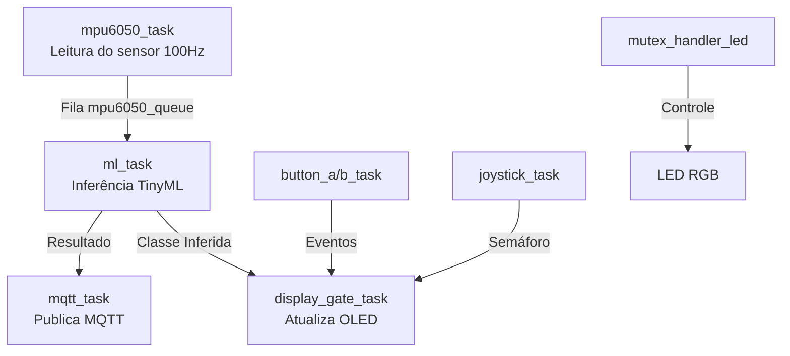

# **Classificação de Movimentos em Contêineres Marítimos com TinyML**

**Autores:** Adriana R. Castro de Paula, Elias Kento Tomiyama, Vagner Sanches Vasconcelos   
**Instituição:** Instituto Hardware BR \- HBr (Projeto Embarcatech \- Fase 2\)  
**Local:** Campinas-SP  
**Data:** 18 de Setembro de 2025

## **1\. Resumo do Projeto**

Este projeto apresenta o desenvolvimento de um sistema embarcado de baixo custo para a **classificação de movimentos de contêineres marítimos** em tempo real. Utilizando a plataforma **BitDogLab** (RP2040), um sensor acelerômetro (MPU6050) e a tecnologia **Tiny Machine Learning (TinyML)**, o sistema identifica quatro classes de movimento: "Parado", "Subindo/Descendo", "Esquerda/Direita" e "Ziguezague".

Os resultados da classificação são exibidos localmente em um display OLED e enviados via Wi-Fi para um broker **MQTT**, permitindo o monitoramento remoto e a otimização da logística. Todo o sistema é orquestrado pelo **FreeRTOS**, garantindo uma execução robusta e concorrente das tarefas.


## **2\. Contexto do Problema e Solução Proposta**

A logística global de contêineres enfrenta desafios no rastreamento e na identificação de eventos específicos, como manuseio incorreto ou anomalias durante o transporte. Os métodos tradicionais, como GPS e registros manuais, não oferecem a granularidade necessária para entender o tipo de movimento.

Para solucionar este desafio, foi desenvolvido um sistema embarcado que confere "inteligência" ao próprio contêiner. A solução se baseia em três pilares principais:

1.  **Sensor de Aceleração (MPU6050):** Captura os dados de movimento do contêiner.
2.  **TinyML na Borda:** Um modelo de Machine Learning, treinado no **Edge Impulse**, executa a inferência diretamente no microcontrolador para analisar os dados do sensor em tempo real, sem a necessidade de uma conexão constante com a nuvem.
3.  **Conectividade IoT (Wi-Fi e MQTT):** Os resultados são transmitidos para uma plataforma de monitoramento remoto, permitindo que operadores logísticos e gestores de frota tenham visibilidade completa da movimentação do contêiner.


## **3\. Arquitetura de Hardware**

O sistema foi construído utilizando os seguintes componentes, com pinos definidos em `config.h`:

* **Placa de desenvolvimento:** BitDogLab, equipada com o Raspberry Pi Pico W (microcontrolador RP2040 Dual-Core ARM Cortex-M0+).  
* **Sensor Inercial:** Acelerômetro e Giroscópio MPU6050, conectado via **I2C0** (GPIO 0 \- SDA e GPIO 1 \- SCL).  
* **Conectividade:** Módulo Wi-Fi CYW43439 integrado à placa Pico W.  
* **Interface de Usuário:**
  * Display OLED SSD1306 128x64, conectado via **I2C1** (GPIO 14 \- SDA e GPIO 15 \- SCL).    
  * 3 Botões de propósito geral (Botão A em GPIO 5, Botão B em GPIO 6 e Botão do Joystick em GPIO 22).  
  * 1 LED RGB para status visual (Vermelho em GPIO 13, Verde em GPIO 11, Azul em GPIO 12).

## **4\. Arquitetura de Software**

O software é orquestrado pelo **FreeRTOS**, garantindo que múltiplas operações ocorram de forma concorrente e sem conflitos. A arquitetura é modular e baseada em tarefas independentes que se comunicam através de mecanismos seguros do RTOS.



* **Tarefas Principais:**  
  * `mpu6050_task`: (Produtor) Tarefa de alta prioridade que lê o acelerômetro a uma taxa fixa (100Hz) e envia os dados para uma fila.  
  * `ml_task`: (Consumidor) Aguarda a chegada de dados na fila do MPU6050. Quando uma janela de dados suficiente é acumulada, executa o modelo de inferência TinyML para classificar o movimento.  
  * `mqtt_task`: Responsável por gerenciar a conexão Wi-Fi e publicar os resultados da classificação em um broker MQTT na nuvem.  
  * `display_gate_task`: Gerencia o acesso ao display OLED, exibindo mensagens de status e resultados recebidos de outras tarefas de forma segura (evitando concorrência).  
  * `button_a/b/j_task`: Tarefas de baixa prioridade que monitoram os botões e geram eventos para o sistema (mensagens na fila ou liberação de semáforos).  
* **Mecanismos de Comunicação:**  
  * **Filas (Queues):** Usadas para transferir dados de forma assíncrona entre tarefas (e.g., dados do acelerômetro para a tarefa de ML, mensagens de status para o display).  
  * **Mutexes:** Utilizados para proteger o acesso a recursos compartilhados, como o barramento I2C (`i2c_mutex`) e o LED RGB (`mutex_handler_led`), garantindo a exclusão mútua e prevenindo condições de corrida.  
  * **Semáforos:** Usados para sinalização entre tarefas, como o botão do joystick que sinaliza à tarefa do display para exibir uma mensagem específica.

## **5\. Tecnologias Utilizadas**

* **Linguagem de Programação:** C/C++  
* **SDK:** Raspberry Pi Pico SDK  
* **Sistema Operacional:** FreeRTOS  
* **Plataforma de ML:** Edge Impulse (para treinamento e otimização do modelo)  
* **Framework de Inferência:** Edge Impulse C++ SDK  
* **Protocolo de Comunicação:** MQTT (com a biblioteca Paho MQTT Embedded C)  
* **Pilha de Rede:** LwIP (integrada ao Pico-W SDK)  
* **Hardware:** BitDogLab, MPU6050, SSD1306

## **6\. Instruções de Setup e Build**

1. **Pré-requisitos:**  
   * Configurar o ambiente de desenvolvimento do Raspberry Pi Pico (Pico SDK, toolchain ARM).  
   * Clonar este repositório para a sua máquina local.  
2. **Configuração do Projeto:**  
   * Abra o arquivo `main.c` e altere as credenciais do Wi-Fi (`ssid` e `pass`) para as da sua rede local.  
   * Abra o arquivo `mqtt_task.c` e configure as macros `MQTT_BROKER_HOST`, `MQTT_USERNAME` e `MQTT_PASSWORD` com as informações do seu broker MQTT.  
3. **Compilação:**  
   * Navegue até a pasta raiz do projeto.  
   * Crie e acesse um diretório de build:
    ```bash
      mkdir build && cd build
    ```  
   * Execute o CMake para gerar os arquivos de compilação e compile o projeto:
    ```bash
      cmake ..
      make -j$(nproc)
    ```    
4. **Gravação (Flashing):**  
   * Conecte a BitDogLab ao seu computador enquanto segura o botão `BOOTSEL` para colocá-la em modo de gravação.  
   * Copie o arquivo `tinyml_gate.uf2` (localizado na pasta `build`) para o novo drive `RPI-RP2` que aparecerá em seu computador. A placa irá reiniciar automaticamente.

## **7\. Instruções de Uso**

* **Inicialização:** Ao ser energizado, o sistema inicializa o Wi-Fi e os periféricos. O LED RGB piscará em vermelho, verde e azul para indicar que está funcional. O display OLED exibirá uma tela de boas-vindas que pisca por 5 segundos.  
* **Operação Normal:** O sistema começa a coletar dados do acelerômetro e a realizar inferências. O resultado da classificação (e.g., "Classe Inferida: parado") será impresso no console serial e publicado no tópico MQTT. Os dados brutos de aceleração dos três eixos (Ax, Ay, Az) serão mostrados continuamente no display.  
* **Interação com Botões:**  
  * **Botão A:** Ao ser pressionado, envia os dados de aceleração para a fila principal, que os exibe no display OLED.  
  * **Botão B:** Pressionar e segurar este botão "reserva" o LED RGB usando um mutex, acendendo-o em verde. Soltar o botão libera o LED.  
  * **Botão Joystick:** Pressionar o joystick libera um semáforo que é capturado pela tarefa do display para exibir uma mensagem de evento.

## **8\. Detalhamento do Código-Fonte**

* **`main.c`**: Ponto de entrada da aplicação. Inicializa hardware, Wi-Fi e cria todas as tarefas do FreeRTOS, definindo suas prioridades e alocação de memória, antes de entregar o controle ao escalonador do RTOS.  
* **`ml.cpp`**: Contém a `ml_task`, o núcleo de IA do sistema. Esta tarefa é orientada a eventos, aguardando dados em uma fila (`xQueueReceive`). Ela preenche um buffer com amostras do acelerômetro (técnica de janelamento) e, quando o buffer está cheio, invoca o classificador do Edge Impulse (`run_classifier`). O resultado é filtrado por um limiar de confiança (`CONFIDENCE_THRESHOLD`) para garantir a precisão da classificação.  
* **`mpu6050.c`**: Driver e tarefa para o sensor inercial. A `mpu6050_task` lê o sensor a uma frequência precisa e envia os dados (convertidos para m/s²) para uma fila, agindo como um "produtor" de dados para a `ml_task`. O acesso ao barramento I2C é protegido por um mutex para garantir a segurança em um ambiente multitarefa.  
* **`mqtt_task.c`**: Implementa a lógica de comunicação IoT. Conecta-se a um broker MQTT (neste caso, `hivemq.cloud`) e publica mensagens de status em formato JSON periodicamente, além de se inscrever em um tópico para receber comandos (`messageArrived` callback). Utiliza uma camada de abstração (`paho_network.c`, `paho_timer.c`) para portar a biblioteca Paho para o ambiente FreeRTOS+LwIP.  
* **`display_gate.c`**: Tarefa que gerencia o display OLED. Ela é projetada para ser a única tarefa que escreve no periférico, recebendo dados de outras tarefas e atualizando a tela para mostrar os valores de aceleração em tempo real. Os múltiplos blocos de código comentados demonstram a evolução da lógica de exibição durante o desenvolvimento.  
* **`button_*.c`**: Cada arquivo implementa uma tarefa dedicada a um botão, tratando o debouncing e convertendo o evento físico (pressionar de botão) em um evento lógico para o sistema (envio de mensagem para fila, liberação de semáforo, ou tomada de mutex).  
* **`ctrl.c`**: Módulo centralizador que inicializa e fornece acesso global aos objetos do FreeRTOS (filas, mutexes, semáforos), uma prática que organiza e simplifica o gerenciamento de recursos.  
* **`display.c` e `ssd1306_i2c.c`**: Sistema de driver de duas camadas para o display. `ssd1306_i2c.c` lida com a comunicação I2C e comandos de baixo nível, enquanto `display.c` oferece uma API de alto nível para a aplicação.  
* **`util.c`**: Contém funções auxiliares, como `util_gera_e_envia_msg`, que formata uma string com um timestamp e a envia para uma fila, padronizando o formato de mensagens no sistema.

## **9\. Conclusão e Resultados**

Este projeto demonstra a capacidade de construir soluções de monitoramento industrial robustas e de baixo custo, combinando microcontroladores modernos, **TinyML** e sistemas operacionais de tempo real. Além disso, o projeto alcançou os seguintes resultados:

* **Identificação de padrões em tempo real**: O sistema é capaz de identificar padrões de movimento sem depender de uma conexão com a internet, usando o modelo de ML executado localmente no RP2040.
* **Validação da arquitetura**: A integração bem-sucedida do MPU6050, OLED e Wi-Fi comprova a viabilidade de uma arquitetura de baixo custo para monitoramento logístico.
* **Robustez com FreeRTOS**: A utilização do FreeRTOS no RP2040 permitiu a coordenação robusta e eficiente de tarefas complexas, como sensoriamento, inferência de IA e comunicação concorrente.

## **10\. Próximos Passos**

* **Testes de campo** em ambientes logísticos reais para validar a solução em condições operacionais.
* Expansão do modelo para reconhecer **mais classes** de movimento, aumentando a granularidade do monitoramento.
* Integração com outros **sensores ambientais** (como temperatura e umidade) para coletar dados mais abrangentes sobre o estado do contêiner.
* Integração de **dashboards** de visualização remota e sistemas de alerta em tempo real.
* Realizar **Provas de Conceito (PoCs)** para aplicações mais avançadas, como a Manutenção Preditiva com TinyML.
